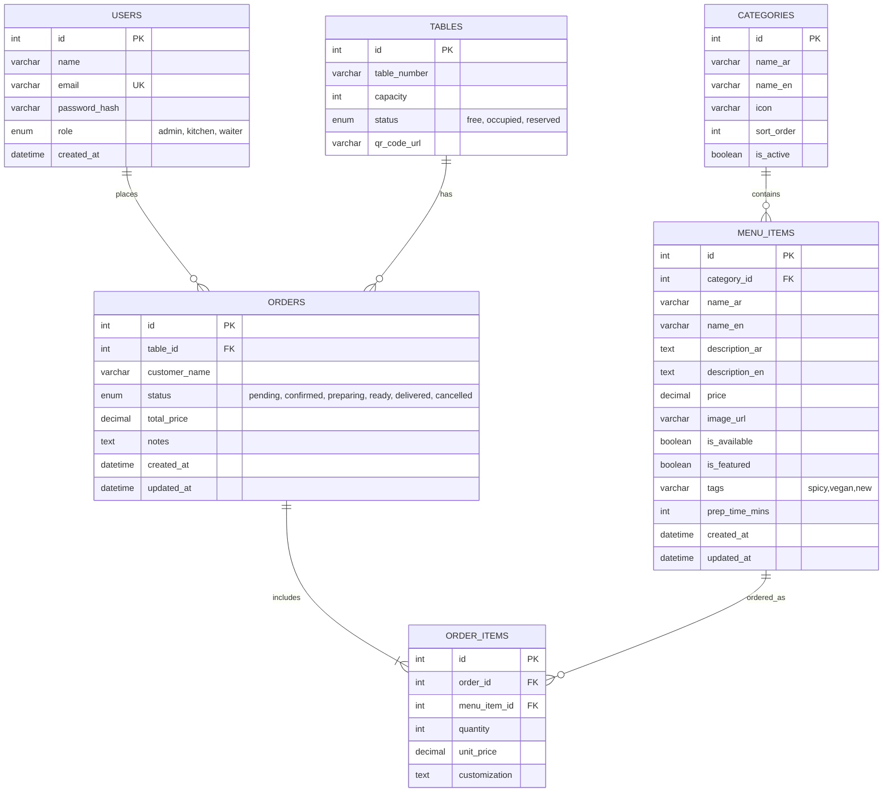
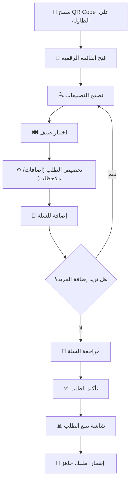

# 🏗️ نظام الطلب الذاتي الذكي - QR Order System
## مقهى ومطعم "أورا لاونج" (Aura Lounge)

---

## 📋 نظرة عامة

نظام طلب ذاتي متكامل يتيح لزبائن مقهى أورا لاونج مسح كود QR على الطاولة للوصول إلى قائمة الطعام الرقمية، واختيار الوجبات وتخصيصها، وإرسال الطلب مباشرة إلى المطبخ — بدون انتظار النادل.

### المكونات الرئيسية:
1. **واجهة العملاء (Customer Frontend)** — React + Vite (Mobile-First)
2. **الواجهة الخلفية (Backend API)** — PHP (RESTful API)
3. **قاعدة البيانات** — MySQL
4. **لوحة المطبخ (Kitchen Dashboard)** — React (شاشة عرض حية)
5. **لوحة الإدارة (Admin Panel)** — React (إدارة CRUD)

---

## 🎨 التصميم البصري والهوية

### لوحة الألوان (Color Palette)
| الاسم | اللون | الاستخدام |
|-------|-------|-----------|
| Deep Charcoal | `#0D0D0D` | الخلفية الرئيسية |
| Surface Dark | `#1A1A2E` | كروت القائمة والعناصر |
| Surface Elevated | `#16213E` | العناصر المرتفعة |
| Aura Gold | `#E2B659` | اللون الرئيسي للعلامة التجارية (CTA) |
| Aura Amber | `#F0C040` | التمييز والأسعار |
| Soft White | `#F5F5F5` | النصوص الرئيسية |
| Muted Gray | `#8B8B8B` | النصوص الثانوية |
| Success Green | `#4ADE80` | حالة "جاهز" |
| Warning Orange | `#FB923C` | حالة "قيد التحضير" |
| Error Red | `#F87171` | حالة "ملغي" / أخطاء |

### الخطوط (Typography)
- **العناوين**: `Outfit` (Google Fonts) — Bold/Semi-bold
- **النصوص العربية**: `Tajawal` (Google Fonts) — لدعم RTL
- **الأسعار والأرقام**: `Inter` — Monospace-like clarity

### التأثيرات البصرية
- **Glassmorphism**: `backdrop-filter: blur(12px)` للكروت
- **Gradient Borders**: تدرج ذهبي خفيف على الحدود
- **Micro-animations**: `transition: all 0.3s ease` لكل العناصر التفاعلية
- **Skeleton Loading**: أثناء تحميل البيانات

---

## 📁 هيكل المشروع

```
weeb/
├── frontend/                    # React + Vite (واجهة العملاء + الإدارة)
│   ├── public/
│   │   └── assets/             # الصور والأيقونات
│   ├── src/
│   │   ├── components/
│   │   │   ├── customer/       # مكونات واجهة العملاء
│   │   │   │   ├── MenuCard.jsx
│   │   │   │   ├── CategoryFilter.jsx
│   │   │   │   ├── CartDrawer.jsx
│   │   │   │   ├── ItemDetail.jsx
│   │   │   │   ├── OrderStatus.jsx
│   │   │   │   └── Header.jsx
│   │   │   ├── kitchen/        # مكونات لوحة المطبخ
│   │   │   │   ├── OrderCard.jsx
│   │   │   │   ├── OrderQueue.jsx
│   │   │   │   └── KitchenStats.jsx
│   │   │   ├── admin/          # مكونات لوحة الإدارة
│   │   │   │   ├── MenuManager.jsx
│   │   │   │   ├── ItemForm.jsx
│   │   │   │   ├── CategoryManager.jsx
│   │   │   │   ├── OrderHistory.jsx
│   │   │   │   └── Dashboard.jsx
│   │   │   └── shared/         # مكونات مشتركة
│   │   │       ├── Loader.jsx
│   │   │       ├── Toast.jsx
│   │   │       └── Modal.jsx
│   │   ├── pages/
│   │   │   ├── CustomerMenu.jsx    # صفحة القائمة (مسح QR)
│   │   │   ├── OrderTracking.jsx   # تتبع الطلب
│   │   │   ├── KitchenView.jsx     # شاشة المطبخ
│   │   │   ├── AdminLogin.jsx      # تسجيل دخول الإدارة
│   │   │   └── AdminDashboard.jsx  # لوحة التحكم
│   │   ├── context/
│   │   │   ├── CartContext.jsx     # سلة المشتريات
│   │   │   └── AuthContext.jsx     # المصادقة
│   │   ├── hooks/
│   │   │   ├── useMenu.js         # جلب القائمة
│   │   │   ├── useOrders.js       # إدارة الطلبات
│   │   │   └── usePolling.js      # تحديث حي
│   │   ├── services/
│   │   │   └── api.js             # Axios API client
│   │   ├── styles/
│   │   │   └── index.css          # التصميم الرئيسي
│   │   ├── App.jsx
│   │   └── main.jsx
│   ├── index.html
│   ├── vite.config.js
│   └── package.json
│
├── backend/                     # PHP Backend
│   ├── config/
│   │   ├── database.php         # اتصال قاعدة البيانات
│   │   └── cors.php             # إعدادات CORS
│   ├── api/
│   │   ├── menu/
│   │   │   ├── read.php         # GET /api/menu
│   │   │   ├── read_single.php  # GET /api/menu/{id}
│   │   │   ├── create.php       # POST /api/menu
│   │   │   ├── update.php       # PUT /api/menu/{id}
│   │   │   └── delete.php       # DELETE /api/menu/{id}
│   │   ├── categories/
│   │   │   ├── read.php         # GET /api/categories
│   │   │   ├── create.php       # POST /api/categories
│   │   │   ├── update.php       # PUT /api/categories/{id}
│   │   │   └── delete.php       # DELETE /api/categories/{id}
│   │   ├── orders/
│   │   │   ├── create.php       # POST /api/orders
│   │   │   ├── read.php         # GET /api/orders
│   │   │   ├── read_single.php  # GET /api/orders/{id}
│   │   │   ├── update.php       # PATCH /api/orders/{id}
│   │   │   └── stats.php        # GET /api/orders/stats
│   │   ├── tables/
│   │   │   ├── read.php         # GET /api/tables
│   │   │   └── generate_qr.php  # GET /api/tables/{id}/qr
│   │   └── auth/
│   │       ├── login.php        # POST /api/auth/login
│   │       └── verify.php       # GET /api/auth/verify
│   ├── models/
│   │   ├── MenuItem.php
│   │   ├── Category.php
│   │   ├── Order.php
│   │   ├── OrderItem.php
│   │   ├── Table.php
│   │   └── User.php
│   ├── middleware/
│   │   └── auth.php             # التحقق من JWT
│   ├── utils/
│   │   ├── response.php         # تنسيق الاستجابة
│   │   └── validator.php        # التحقق من المدخلات
│   └── .htaccess                # URL Rewriting
│
├── database/
│   └── schema.sql               # هيكل قاعدة البيانات + بيانات تجريبية
│
└── README.md
```

---

## 🗄️ تصميم قاعدة البيانات (MySQL)



### الجداول بالتفصيل:

| الجدول | الوصف | الحقول الرئيسية |
|--------|-------|-----------------|
| `users` | حسابات الإدارة والمطبخ | الاسم، البريد، كلمة المرور المُشفّرة، الدور |
| `categories` | تصنيفات القائمة (مشروبات ساخنة، حلويات...) | اسم عربي/إنجليزي، أيقونة، ترتيب |
| `menu_items` | أصناف القائمة | اسم ثنائي اللغة، وصف، سعر، صورة، حالة التوفر |
| `tables` | طاولات المقهى | رقم الطاولة، السعة، رابط QR |
| `orders` | الطلبات | رقم الطاولة، الحالة، المجموع، ملاحظات |
| `order_items` | تفاصيل عناصر الطلب | الصنف، الكمية، السعر وقت الطلب، التخصيصات |

---

## 🔌 واجهات REST API

### نقاط النهاية (Endpoints)

#### القائمة (Menu)
| Method | Endpoint | الوصف | Auth |
|--------|----------|-------|------|
| `GET` | `/api/menu` | جلب جميع الأصناف مع التصنيفات | ❌ |
| `GET` | `/api/menu/{id}` | جلب تفاصيل صنف | ❌ |
| `POST` | `/api/menu` | إضافة صنف جديد | ✅ Admin |
| `PUT` | `/api/menu/{id}` | تعديل صنف | ✅ Admin |
| `DELETE` | `/api/menu/{id}` | حذف صنف | ✅ Admin |

#### التصنيفات (Categories)
| Method | Endpoint | الوصف | Auth |
|--------|----------|-------|------|
| `GET` | `/api/categories` | جلب جميع التصنيفات | ❌ |
| `POST` | `/api/categories` | إضافة تصنيف | ✅ Admin |
| `PUT` | `/api/categories/{id}` | تعديل تصنيف | ✅ Admin |
| `DELETE` | `/api/categories/{id}` | حذف تصنيف | ✅ Admin |

#### الطلبات (Orders)
| Method | Endpoint | الوصف | Auth |
|--------|----------|-------|------|
| `POST` | `/api/orders` | إنشاء طلب جديد | ❌ |
| `GET` | `/api/orders/{id}` | تتبع حالة طلب | ❌ |
| `GET` | `/api/orders` | جلب جميع الطلبات (مع فلاتر) | ✅ Kitchen/Admin |
| `PATCH` | `/api/orders/{id}` | تحديث حالة الطلب | ✅ Kitchen/Admin |
| `GET` | `/api/orders/stats` | إحصائيات الطلبات | ✅ Admin |

#### المصادقة (Auth)
| Method | Endpoint | الوصف | Auth |
|--------|----------|-------|------|
| `POST` | `/api/auth/login` | تسجيل الدخول (JWT) | ❌ |
| `GET` | `/api/auth/verify` | التحقق من التوكن | ✅ |

#### الطاولات (Tables)
| Method | Endpoint | الوصف | Auth |
|--------|----------|-------|------|
| `GET` | `/api/tables` | جلب الطاولات | ✅ Admin |
| `GET` | `/api/tables/{id}/qr` | توليد QR Code | ✅ Admin |

---

## 📱 واجهة العملاء (Customer Frontend)

### تدفق المستخدم (User Flow)



### الشاشات الرئيسية:

1. **شاشة القائمة (Menu Screen)**
   - شريط بحث علوي
   - فلتر تصنيفات أفقي قابل للتمرير (Sticky)
   - كروت أصناف بتصميم Glassmorphism
   - صورة الصنف + الاسم + الوصف المختصر + السعر
   - شارات: "جديد" 🆕، "حار" 🌶️، "الأكثر طلباً" ⭐
   - زر عائم للسلة مع عدد العناصر

2. **شاشة تفاصيل الصنف (Item Detail)**
   - صورة كبيرة
   - وصف تفصيلي
   - خيارات التخصيص (الحجم، الإضافات)
   - عداد الكمية (+/-)
   - حقل ملاحظات خاصة
   - زر "أضف للسلة" بارز

3. **درج السلة (Cart Drawer)**
   - قائمة العناصر المختارة مع خيار التعديل/الحذف
   - حساب المجموع الفرعي والإجمالي
   - حقل اسم الزبون (اختياري)
   - حقل ملاحظات عامة
   - زر "تأكيد الطلب"

4. **شاشة تتبع الطلب (Order Tracking)**
   - رقم الطلب
   - شريط تقدم متحرك (Pending → Confirmed → Preparing → Ready)
   - تفاصيل الطلب
   - الوقت المقدر
   - تحديث تلقائي كل 10 ثوانٍ (Polling)

---

## 🍳 لوحة المطبخ (Kitchen Dashboard)

### الميزات:
- **عرض الطلبات الجديدة** فوراً عند وصولها (تحديث كل 5 ثوانٍ)
- **كروت طلبات ملونة** حسب الحالة:
  - 🟡 أصفر = جديد (Pending)
  - 🟠 برتقالي = قيد التحضير (Preparing)
  - 🟢 أخضر = جاهز (Ready)
- **أزرار تغيير الحالة** بنقرة واحدة
- **إحصائيات سريعة**: عدد الطلبات المعلقة، متوسط وقت التحضير
- **صوت تنبيه** عند وصول طلب جديد 🔔
- **عرض مُحسَّن للشاشات الكبيرة** (TV/Tablet)

---

## ⚙️ لوحة الإدارة (Admin Panel)

### الميزات:

1. **لوحة القيادة (Dashboard)**
   - إجمالي الطلبات اليوم
   - الإيرادات اليومية
   - الأصناف الأكثر طلباً (Top 5)
   - رسم بياني للطلبات بالساعة

2. **إدارة القائمة (Menu Management)**
   - عرض جميع الأصناف في جدول
   - إضافة صنف جديد (نموذج مع رفع صورة)
   - تعديل الأصناف
   - تفعيل/تعطيل صنف (Toggle)
   - حذف مع تأكيد

3. **إدارة التصنيفات**
   - إضافة/تعديل/حذف التصنيفات
   - ترتيب السحب والإفلات (Drag & Drop)

4. **سجل الطلبات**
   - عرض جميع الطلبات مع فلاتر (الحالة، التاريخ)
   - تفاصيل كل طلب
   - تصدير CSV

5. **إدارة الطاولات**
   - إضافة طاولات
   - توليد وطباعة أكواد QR

---

## 🔐 الأمان

| الجانب | التقنية |
|--------|---------|
| تشفير كلمات المرور | `password_hash()` — bcrypt |
| المصادقة | JWT (JSON Web Tokens) |
| حماية SQL Injection | PDO Prepared Statements |
| حماية XSS | `htmlspecialchars()` + React's built-in escaping |
| CORS | إعدادات محددة للنطاق المسموح |
| التحقق من المدخلات | Server-side validation لكل الحقول |

---

## 🌍 دعم اللغة

- **ثنائي اللغة**: عربي (RTL) + إنجليزي (LTR)
- **الافتراضي**: عربي (حسب السوق السعودي المستهدف)
- **التبديل**: زر تبديل اللغة في Header
- **البيانات**: كل صنف وتصنيف يحتوي على حقول عربية وإنجليزية

---

## User Review Required

> [!IMPORTANT]
> ### قرارات تصميمية تحتاج موافقتك:
> 1. **المدفوعات**: هل يتم الدفع عبر النظام إلكترونياً أم فقط إرسال الطلب والدفع عند الكاشير؟ (الخطة الحالية: إرسال الطلب فقط بدون دفع إلكتروني)
> 2. **تشغيل PHP**: هل لديك XAMPP/WAMP/MAMP مُثبت أم تفضل استخدام PHP Built-in Server؟
> 3. **البيانات التجريبية**: هل لديك قائمة أصناف حقيقية لأورا لاونج أم نستخدم بيانات تجريبية عربية مناسبة؟
> 4. **رفع الصور**: هل تريد رفع صور حقيقية للأصناف أم نستخدم صور مُولّدة؟

> [!WARNING]
> ### متطلبات مسبقة:
> - **Node.js** (v18+) لتشغيل React/Vite
> - **PHP** (v8.0+) للخادم الخلفي
> - **MySQL** (v8.0+) أو MariaDB لقاعدة البيانات
> - **Composer** (اختياري) لإدارة مكتبات PHP

---

## Open Questions

> [!IMPORTANT]
> 1. هل تريد بدء التطوير بالـ Frontend أولاً (مع بيانات mock) أم Backend أولاً؟ أنا أقترح البدء بـ Backend + Database ثم Frontend.
> 2. هل هناك شعار (Logo) لأورا لاونج نستخدمه أم نُصمم شعاراً مؤقتاً؟
> 3. كم عدد الطاولات التقريبي في المقهى؟ (لتوليد أكواد QR)
> 4. هل تريد تطبيق الـ Real-time بـ Polling (أبسط) أم WebSockets (أكثر تفاعلية)؟

---

## Proposed Changes

### المرحلة 1: البنية التحتية (Foundation)

#### [NEW] [schema.sql](file:///c:/Users/Lenovo/Desktop/work/مجمد%20المغاوني/weeb/database/schema.sql)
- إنشاء جميع الجداول مع العلاقات والقيود
- إدراج بيانات تجريبية (تصنيفات + أصناف + طاولات + مستخدم admin)
- إعدادات `utf8mb4_unicode_ci` لدعم العربية

#### [NEW] [database.php](file:///c:/Users/Lenovo/Desktop/work/مجمد%20المغاوني/weeb/backend/config/database.php)
- كلاس PDO للاتصال بقاعدة البيانات مع error handling

#### [NEW] [cors.php](file:///c:/Users/Lenovo/Desktop/work/مجمد%20المغاوني/weeb/backend/config/cors.php)
- إعدادات CORS للسماح بطلبات React

---

### المرحلة 2: النماذج والـ API (Backend)

#### [NEW] Models — `MenuItem.php`, `Category.php`, `Order.php`, `OrderItem.php`, `Table.php`, `User.php`
- كلاسات PHP لكل جدول مع CRUD operations
- PDO Prepared Statements

#### [NEW] API Endpoints — جميع ملفات `api/`
- نقاط نهاية RESTful لكل العمليات
- JWT middleware للحماية
- Input validation

#### [NEW] [.htaccess](file:///c:/Users/Lenovo/Desktop/work/مجمد%20المغاوني/weeb/backend/.htaccess)
- URL Rewriting لتوجيه الطلبات

---

### المرحلة 3: واجهة العملاء (Customer Frontend)

#### [NEW] Vite + React Project — `frontend/`
- تهيئة المشروع بـ `npx create-vite`
- React Router للتنقل
- Axios للاتصال بالـ API

#### [NEW] `index.css` — نظام التصميم الكامل
- متغيرات CSS (الألوان، الخطوط، المسافات)
- تصميم Glassmorphism
- أنيميشن وتأثيرات
- دعم RTL

#### [NEW] Customer Components — القائمة، السلة، تتبع الطلب
- `MenuCard.jsx`, `CategoryFilter.jsx`, `CartDrawer.jsx`
- `ItemDetail.jsx`, `OrderStatus.jsx`, `Header.jsx`

---

### المرحلة 4: لوحات التحكم (Kitchen + Admin)

#### [NEW] Kitchen View — `KitchenView.jsx`
- عرض الطلبات الحية
- أزرار تغيير الحالة
- صوت تنبيه

#### [NEW] Admin Components — إدارة القائمة والتصنيفات
- `MenuManager.jsx`, `ItemForm.jsx`, `CategoryManager.jsx`
- `OrderHistory.jsx`, `Dashboard.jsx`
- `AdminLogin.jsx`

---

## Verification Plan

### Automated Tests
1. **API Testing**: اختبار كل endpoint يدوياً باستخدام Postman/curl
2. **Frontend**: فتح التطبيق في المتصفح والتأكد من جميع الوظائف
3. **Database**: التحقق من إنشاء الجداول والعلاقات بنجاح

### Manual Verification
1. **تدفق العميل الكامل**: مسح QR → تصفح → طلب → تتبع
2. **تدفق المطبخ**: استقبال طلب → تغيير الحالة → إكمال
3. **تدفق الإدارة**: تسجيل دخول → إضافة صنف → تعديل → حذف
4. **التجاوب (Responsive)**: اختبار على أحجام شاشات مختلفة
5. **RTL**: التأكد من عرض المحتوى العربي بشكل صحيح
6. **Browser Testing**: تشغيل وتسجيل تدفق المستخدم عبر أداة Browser
